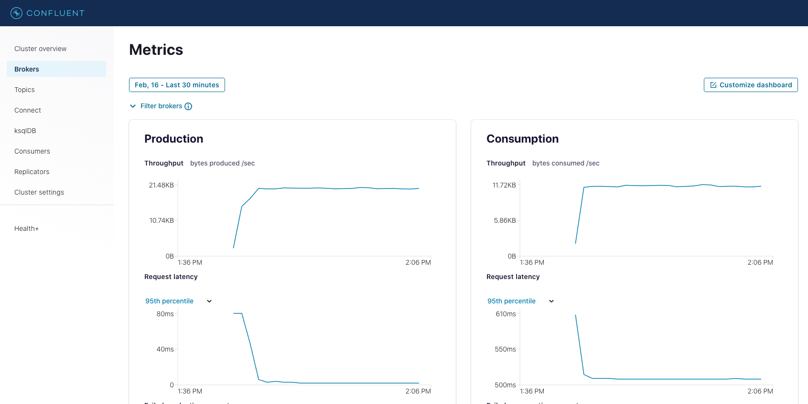

# Prometheus/GrafanaによるConfluent Platform (Kafka) の監視 - JDBC Connector経由のデータ取得フロー
## Overview

Kafka Connect (JDBC Connector) を利用して、データベース (Postgres) から抽出したデータ更新イベントをKafkaに送る - この全体フローを横断的に観測する。  
Confluent (Kafka Broker含む) は個々のコンポーネントのメトリクスをJMX経由で提供しており、このサンプルではPrometheusのJMX Exporterを利用して収集/転送している。Grafanaのダッシュボードサンプルを含む。

### 備考
- Prometheus設定、Grafanaダッシュボードは https://github.com/confluentinc/jmx-monitoring-stacks より取得。(別リポジトリとの併用前提パッケージである為カスタマイズ)
    - Elastic/Kibana, Confluent Cloud等いくつか選択肢あり。今回はPrometheus/Grafanaのみ抽出。
    - 簡素化の為Kafka Lag Exporterの設定を除外。
- ZookeeperならびにKafka Brokerはx1構成。（デフォルトは3）この為Replication Factor等の追加定義を含んでいます。
- 1テーブル、テストデータ件数は10件の最小構成。JDBC Connectorのbulkで全件100ms周期で取得しています。Kafkaに送った後は未処理です。（Consumer無し。追加はカスタマイズ可能。）
- 商用利用を想定していません。稼働の一定日数を超過 (評価ライセンス期間) を超過すると利用出来なくなります。
- 各コンポーネントのバージョンは以下の通り：
    - Confluent Platform 7.0.1
    - Postgres 14.2
    - Prometheus 2.29.2
    - Prometheus Node Exporter 1.2.2
    - Grafana 8.1.3

## 手順
このリポジトリをclone後、Docker Composeを起動。

```bash
git clone https://github.com/shinichi-hashitani/cdc-jdbc-prometheus.git
cd cdc-jdbc-prometheus
docker-compose up -d
```

## リポジトリ構成構成

- assets/Grafana  
データソース定義ならびに各Confluentコンポーネント毎のダッシュボード定義。
- assets/prometheus  
prometheus.ymlおよびalert.rules。
- connect_scripts
Connect Cluster起動時の実行スクリプト。具体的にはConnector (JDBC Connector, etc.) の取得とConnectorの登録。
- jmx-exporter  
JMX agent jarおよび各Confluentコンポーネントの取得メトリクス定義。
- ksqldb_scripts  
ksqlDB Server起動時の実行スクリプト。現在は空。
- postgres  
DBのテーブル作成及びテストデータ投入スクリプト。
- docker-compose.yml  
クラスタの全体構成定義 (メトリクス収集定義を含む)

## 利用方法/カスタマイズ方法
### 各環境へのアクセス
Confluent Control Center
```bash
http://localhost:9021 
```

Grafana
```bash
http://localhost:3000
user: admin
password: password 
```

Postgres
```bash
docker exec -it postgres /bin/bash
psql -U postgres
\d
              List of relations
 Schema |     Name     |   Type   |  Owner
--------+--------------+----------+----------
 public | users        | table    | postgres
 public | users_id_seq | sequence | postgres
(2 rows)

user: postgres
password: postgres
```
### Control Center
クラスタ全体像（対象クラスタを選択して表示 - 本構成では1クラスタのみ登録) 。


Broker View - Producer/Consumerの全体情報、Partition情報ならびにDisk/Networkの情報。


Connect Cluster View - Connect Clusterの概要表示、ならびにConnectorの追加、構成変更、停止/再開が可能。


### Grafana
登録済みダッシュボードはDashboard/Manageメニューから一覧表示。


ダッシュボード例：Connect Cluster


### カスタマイズ - Postgres
テストスクリプト及びデータは postgres/docker-entrypoint-initdb.d フォルダ配下に格納


sqlスクリプトは番号順に実行される：
- 1_tables.sql - テストテーブルの作成
- 2_data.sql - テストデータ読み込み (copyコマンド) の実行
- users.csv - テストデータ

これらは個別にカスタマイズ可能。変更後クラスタ再起動（docker-compose down & docker-compose up -d) にて反映される。